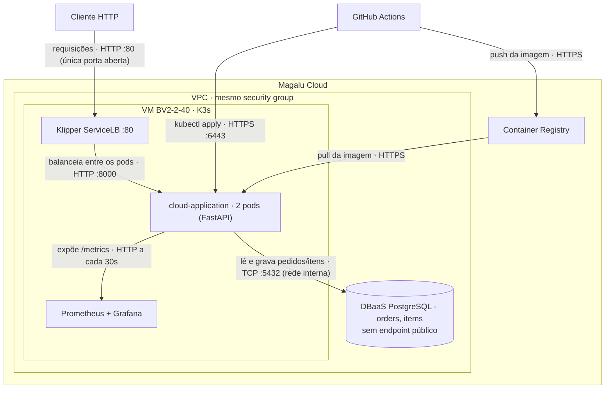

# Arquitetura

API de pedidos containerizada, rodando em um cluster K3s (nó único) numa VM
na Magalu Cloud, com banco PostgreSQL gerenciado externo, imagens no Container
Registry e deploy automatizado pelo GitHub Actions.

## Diagrama C2 · Container

O banco fica **fora da VM**: recriar a VM ou o cluster não leva os dados junto.

## Requisitos não-funcionais

| Requisito | Como medir | Alvo |
|---|---|---|
| Disponibilidade | Erros 5xx e uptime das probes no Grafana | 99,5% mensal |
| Latência | `histogram_quantile(0.95, ...)` sobre o `/metrics` | P95 < 500 ms |
| Escalabilidade | Teste de carga (k6) + `rate(http_requests_total)` | 300 req/s sem degradar |
| Custo | VM + DBaaS + IP na calculadora MGC | Teto definido em ADR |

Dois limites conhecidos: com K3s de nó único, a VM é ponto único de falha — os 99,5%
dependem dela, não só das réplicas. E os containers ainda não declaram
`resources.requests/limits`, então os 300 req/s são alvo assumido, não medido.

## Estilo arquitetural

**Monolito em camadas** (apresentação → serviço → dados), implantado como container
único com duas réplicas sem estado — todo o estado vive no DBaaS, o que é justamente
o que permite escalar por réplicas.

| Camada | Onde |
|---|---|
| Apresentação | `app/main.py` — rotas FastAPI, validação Pydantic |
| Serviço | `app/main.py` — regras de pedido (status, vínculo item→pedido) |
| Dados | `app/models.py`, `app/database.py` — ORM e sessão SQLAlchemy |

**Estilo-alvo:** se o domínio de notificações crescer, extrair um segundo serviço que
consome eventos de pedido de forma assíncrona. O gancho já existe no código:
`logger.info({"event": "order_created", ...})`.

## Trade-offs

| Aspecto | Decisão tomada | Alternativa não escolhida | Motivo da escolha |
|---|---|---|---|
| Deploy | K3s em VM | MKS (Kubernetes gerenciado) | Custo menor, provisionamento < 2 min, manifests idênticos |
| Banco | DBaaS gerenciado | PostgreSQL em container | Backup automático, sem administração |
| CI/CD | GitHub Actions | Deploy manual | Consistência e rastreabilidade |
| Réplicas | 2 pods | 1 pod | Disponibilidade mínima sem custo excessivo |
| API | FastAPI (Python) | Node.js, Go, Java | Curva de aprendizado baixa, alta produtividade |

O preço de cada escolha:

- **K3s em VM** troca alta disponibilidade por custo. O nó é único: uma queda da VM
  derruba as duas réplicas juntas. As 2 réplicas protegem contra falha de processo
  (crash, OOM, rollout), não contra falha de nó.
- **DBaaS** amarra o projeto à MGC — o banco deixa de ser portátil junto com os
  manifests.
- **GitHub Actions** exige expor a 6443 do kube-apiserver (ver [Rede](#rede)).
- **2 réplicas fixas** custam o dobro em ociosidade e ainda assim não absorvem picos
  acima do previsto — é um número escolhido, não medido.

## Pontos de melhoria

### Escalabilidade

A aplicação é stateless, então escala na horizontal — mais réplicas atrás do
balanceador. Hoje são 2 réplicas fixas; o próximo passo natural é o **HPA** (Horizontal
Pod Autoscaler), que ajusta esse número automaticamente pela utilização de CPU
(ex.: mínimo 2, máximo 6, alvo de 70%).

### Próximos passos

| Melhoria | Por quê |
|---|---|
| Versionamento de API | `/v1/orders` permite evoluir sem quebrar clientes |
| Rate limiting | Evita abuso e protege o banco de sobrecargas |
| Cache (Redis) | Reduz consultas repetidas ao banco |
| Migrações de schema (Alembic) | Controle de versão das mudanças no banco |
| Testes de carga | Valida o comportamento sob alto tráfego |